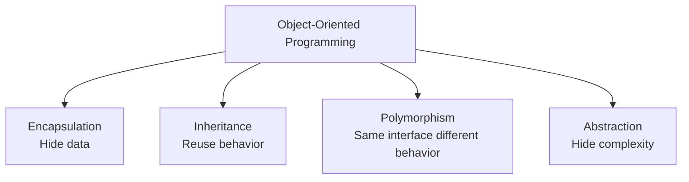

# OOP Revision — Classes, Encapsulation, Inheritance, Abstraction

---

## What problem does this solve?

Before design patterns and SOLID, you need to **think in objects**. Real-world entities (students, bank accounts, movies) become classes with state (attributes) and behavior (methods). This folder builds that mental model from scratch.

---

## Real-world analogy

| OOP Concept | Real Life |
|-------------|-----------|
| **Class** | Blueprint for a house |
| **Object** | Actual house built from blueprint |
| **Encapsulation** | Safe deposit box — access via teller only |
| **Inheritance** | Child inherits family name and traits |
| **Abstraction** | Car dashboard — you steer without knowing engine internals |

---

## Folder Structure

```
1. Revision/
├── classes_objects.py    ← Student: basic class anatomy
├── enacapsulation.py     ← Bank: private balance, getters, deposit/withdraw
├── inheritance.py        ← Dog extends Animal, super(), override move()
├── abstraction.py        ← Shape ABC, Rectangle implements area/perimeter
├── movie_project.py      ← Movie booking — practical mini-project
├── NOTES.md
├── FLOW.md
├── UML.md
├── INTERVIEW.md
└── CHEATSHEET.md
```

---

## File-by-File Walkthrough

### `classes_objects.py` — Classes & Objects

```python
class Student:
    def __init__(self, name, age, gender):
        self.name = name
        ...
    def display(self): ...
    def get_age(self) -> int: ...
```

**Key ideas:** `__init__` constructor, `self` refers to current instance, methods read/write instance state.

### `enacapsulation.py` — Data Hiding

```python
class Bank:
    def __init__(self, name, balance):
        self.__balance = balance  # name mangled — "private"
```

| Concept | Implementation |
|---------|----------------|
| Private data | `__balance` (Python name mangling) |
| Controlled access | `get_balance()`, `set_balance()` |
| Business logic | `deposit()`, `withdraw()` |
| Hidden helper | `__isServerLive()` |

> **⚠️ Common Mistake**
>
> `__balance` is not truly private — it's mangled to `_Bank__balance`. Convention: single `_` for "protected."

### `inheritance.py` — IS-A Relationship

```python
class Dog(Animal):
    def __init__(self, name, age, breed):
        super().__init__(name, age)  # call parent constructor
    def move(self):
        print("Dog is running")  # override parent method
```

**Why `super()`?** Parent `__init__` initializes shared attributes (`name`, `age`). Child adds `breed` and customizes behavior.

### `abstraction.py` — Abstract Base Classes

```python
class Shape(ABC):
    @abstractmethod
    def area(self): pass

class Rectangle(Shape):
    def area(self):
        print(self.length * self.breadth)
```

**Abstraction** = define *what* (area, perimeter) without *how*. `Rectangle` provides the how. You cannot instantiate `Shape` directly.

### `movie_project.py` — Putting It Together

`Movie` tracks seats, price, bookings. Methods mutate state (`book_tickets`) and report status (`show_status`). This is how LLD interviews start — model the domain first.

---

## Four Pillars Summary



---

## Python Features Used

| Feature | File | Purpose |
|---------|------|---------|
| `class` / `__init__` | All | Define types and constructors |
| `__attr` name mangling | encapsulation | Hide internal state |
| `super()` | inheritance | Parent initialization |
| `abc.ABC` | abstraction | Abstract interfaces |
| `@abstractmethod` | abstraction | Force subclass implementation |
| Type hints | most files | Document types for readers |

**Python vs Java:** Python has no `public`/`private` keywords. Use naming conventions (`__`, `_`) and ABCs instead of `interface` keyword.

---

## Execution Flow

Run each file independently:

```bash
cd "1. OOPS Recap/1. Revision"
python classes_objects.py
python enacapsulation.py
python inheritance.py
python abstraction.py
python movie_project.py
```

---

## Memory Model

```
Stack                    Heap
─────                    ────
student ──────────────►  Student object
                           name = "Rahul"
                           age = 20
```

Variables on the stack hold **references** to objects on the heap. Multiple variables can reference the same object.

---

## Interview Questions Preview

1. Encapsulation vs abstraction?
2. When to use inheritance vs composition?
3. What does `super()` do?
4. Can you instantiate an ABC?
5. Design a `BankAccount` class with proper encapsulation.

See [INTERVIEW.md](INTERVIEW.md).

---

## Summary

This folder is your **OOP foundation**. Every pattern in this course assumes you can define classes, hide data, extend behavior, and program to abstractions. Master these five files before moving to UML and SOLID.

---

## 📌 5 Minute Revision

1. **Class** = blueprint; **object** = instance
2. **Encapsulation** = `__private` + getters/setters
3. **Inheritance** = `class Child(Parent)` + `super()`
4. **Abstraction** = `ABC` + `@abstractmethod`
5. **movie_project** = domain modeling practice

## 📌 Next Topic

[2. UML Basics](../2.%20UML%20Basics/NOTES.md)
