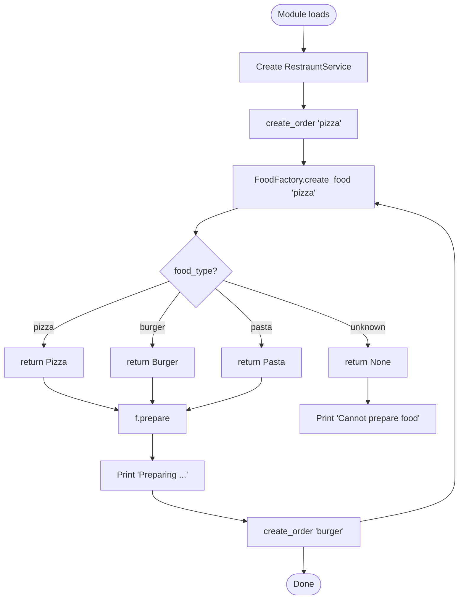
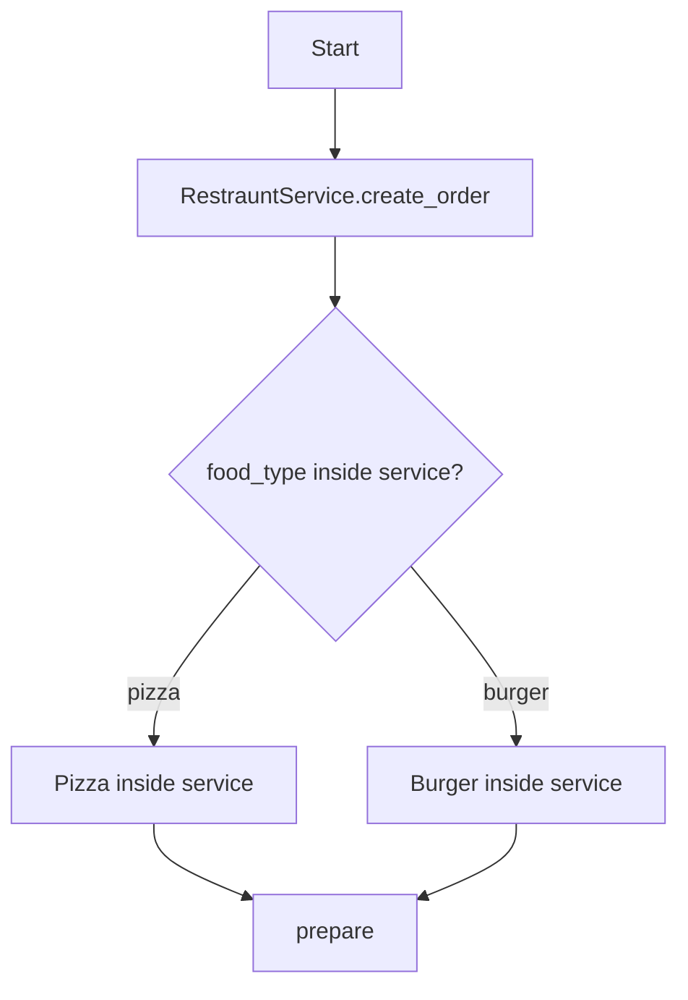
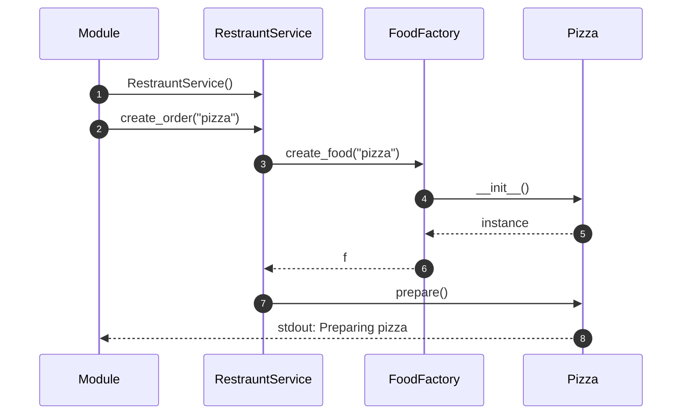
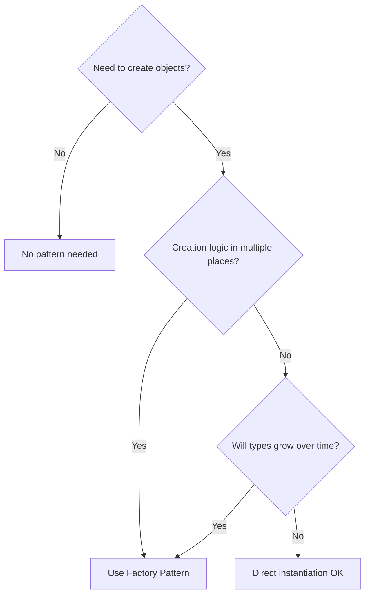

# Factory Pattern — Execution Flow

---

## Running the Good Example

```bash
cd "12. Factory Pattern"
python good_example.py
```

---

## Flowchart — `good_example.py`



---

## Step-by-Step: First Order (`"pizza"`)

| Step | What Happens | Code Location |
|------|--------------|---------------|
| 1 | Python loads module | `good_example.py` top |
| 2 | `RestrauntService()` instantiated | line 54 |
| 3 | `create_order("pizza")` called | line 55 |
| 4 | Service calls `FoodFactory.create_food("pizza")` | line 46 |
| 5 | Factory matches `"pizza"` → `return Pizza()` | lines 34-35 |
| 6 | `f` is not `None` → `f.prepare()` | line 50 |
| 7 | `Pizza.prepare()` prints `"Preparing pizza"` | lines 17-18 |

---

## Step-by-Step: Second Order (`"burger"`)

Same flow; factory returns `Burger()`; prints `"Preparing burger"`.

---

## Bad Example Flow — Contrast



**Difference:** Creation `if/elif` lives **inside** `RestrauntService` — no separate factory.

---

## Object Call Sequence



---

## Decision Tree — When to Use Factory



---

## Memory Flow

```
1. RestrauntService created on heap
2. create_order() pushed on call stack
3. FoodFactory.create_food() pushed on stack
4. Pizza() allocated on heap
5. Reference returned to create_order's local `f`
6. prepare() called — method lookup on Pizza class
7. Stack unwinds; `f` may be garbage collected if not returned
```

---

## 📌 Quick Revision

**Good:** `Service → Factory → Product → prepare()`  
**Bad:** `Service → if/elif create → prepare()`
