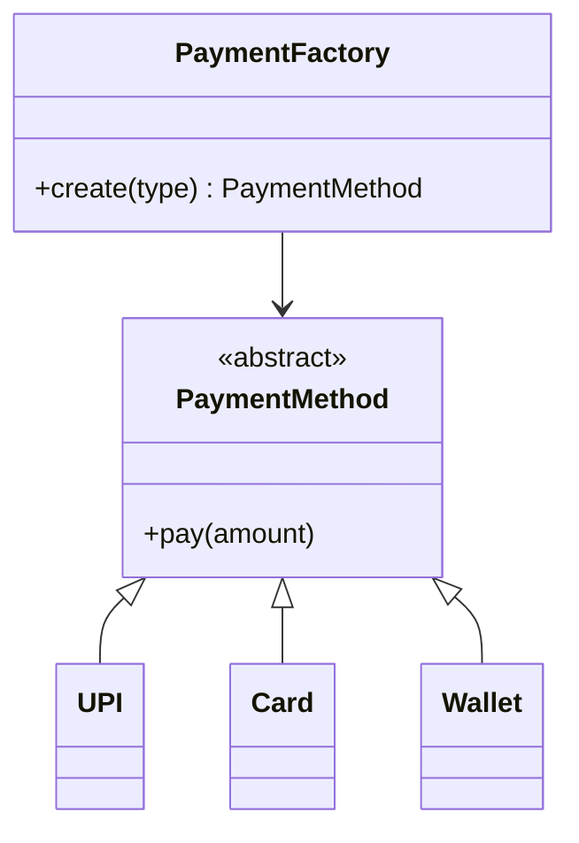

# Factory Pattern — Interview Q&A

---

## Core Questions

### 1. What is the Factory Pattern?

**Answer:** A creational pattern that provides an interface for creating objects without specifying their exact classes. A factory class encapsulates instantiation logic; clients request objects by type/key and receive them through a common interface.

---

### 2. Why use Factory instead of `new Pizza()` directly?

**Answer:** Direct instantiation couples the client to concrete classes. When you add `Pasta`, every caller must change. A factory centralizes creation — one edit point, easier testing, and compliance with Open/Closed Principle.

---

### 3. Difference between Factory and Abstract Factory?

| Factory | Abstract Factory |
|---------|------------------|
| Creates **one** product type | Creates **families** of related products |
| `create_food("pizza")` | `create_starter()`, `create_main()`, `create_dessert()` |
| One dimension of variation | Two dimensions (cuisine × course) |
| See folder 12 | See folder 13 |

---

### 4. Difference between Factory and Builder?

| Factory | Builder |
|---------|---------|
| **Which** object to create | **How** to configure a complex object |
| Usually one step | Multiple fluent steps |
| `create_food("pizza")` | `builder.set_ram(16).set_color("black").build()` |
| See folder 12 | See folder 14 |

---

### 5. Difference between Factory and Prototype?

| Factory | Prototype |
|---------|-----------|
| Creates **new** objects from scratch | **Clones** existing objects |
| Uses constructors | Uses `copy.deepcopy` or `clone()` |
| Type selection | Copy existing state |

---

### 6. Is a static method factory a "real" Factory Pattern?

**Answer:** Gang of Four distinguishes **Factory Method** (subclass decides) vs **Simple Factory** (static method). Interviewers accept `@staticmethod create_food()` as a practical Simple Factory. For full Factory Method, subclasses override `create_product()`.

---

### 7. Where have you used Factory Pattern?

**Sample answer:** "In a notification system, I used a `NotificationFactory` to create `EmailNotification`, `SMSNotification`, or `PushNotification` based on user preferences. The `NotificationService` only called `factory.create(channel_type)` — adding Slack notifications required only a new class and one factory branch."

---

### 8. How does Factory relate to SOLID?

| Principle | How Factory Helps |
|-----------|-------------------|
| **SRP** | Service orders food; factory creates it |
| **OCP** | Add products without editing service |
| **DIP** | Service depends on `Food` abstraction, not `Pizza` |

---

### 9. What are disadvantages of Factory Pattern?

- Extra layer of indirection
- String/enum-based selection can fail at runtime
- Single factory can become a "god class" with 50+ branches
- Overkill for 2–3 types that never change

---

### 10. How would you design a Factory for a payment system?

Use Enum for types, registry dict instead of long if/elif, inject factory in tests.

---

### 11. Factory vs Dependency Injection?

**Answer:** Factory **creates** objects. DI **provides** already-created dependencies. Often combined: DI container uses factories internally to wire dependencies.

---

### 12. How do you test code that uses a Factory?

- Mock `FoodFactory.create_food` to return a test double
- Inject factory as dependency (constructor injection)
- Use a test factory that returns stub products

---

### 13. When should you NOT use Factory?

- Only one implementation, never changes
- Creation is trivial and local
- Framework already provides DI container

---

### 14. How is Factory used in Django/Spring?

**Django:** `Model.objects` is a manager factory for queries. **Spring:** `BeanFactory` creates and wires beans from configuration.

---

### 15. Design a Logger Factory for file vs console vs remote logging.

**Approach:** `LoggerFactory.create("file")` returns `FileLogger` implementing `Logger` interface. Client code calls `logger.log(msg)` polymorphically.

---

## Scenario Questions

### Design Uber's vehicle assignment

**Hint:** `VehicleFactory.create(ride_type)` → `EconomyCar`, `PremiumCar`, `Bike`. Matching service uses factory, not raw constructors.

### You have 20 food types — factory file is huge. What do you do?

**Answer:** Registry pattern — `PRODUCTS = {"pizza": Pizza, "burger": Burger}`; `create(type)` does `PRODUCTS[type]()`. Or split into `DessertFactory`, `MainCourseFactory`.

---

## 📌 Interview Tip

> Always mention **problem first**, then pattern: "Creation logic was duplicated → introduced Factory to centralize it."

---

## 📌 Red Flags Interviewers Watch For

- Confusing Factory with Singleton
- Saying Factory always requires inheritance
- Not knowing Simple vs Factory Method vs Abstract Factory
