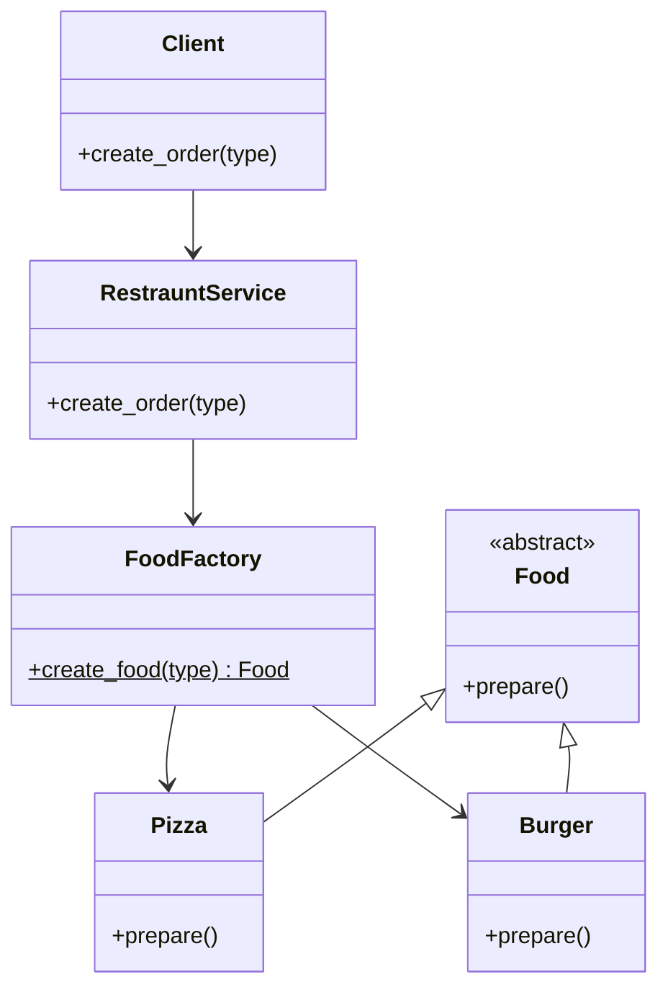
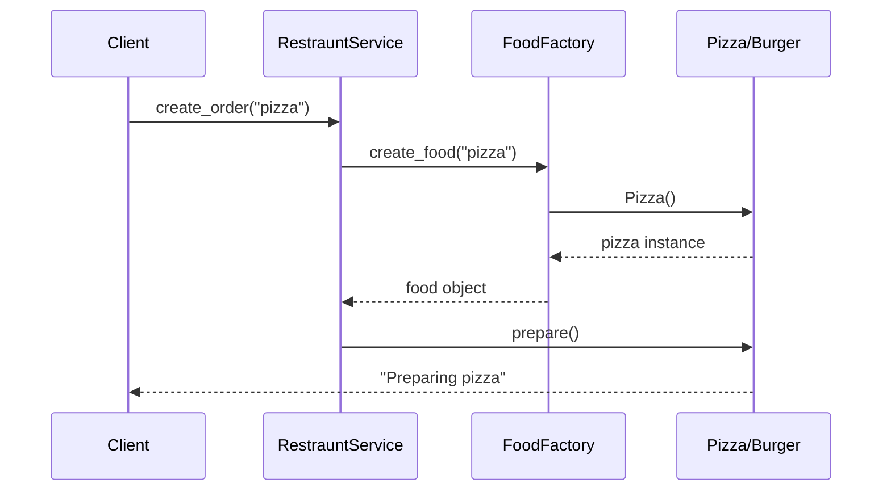

# Factory Pattern

---

## What problem does this solve?

Imagine ordering food on **Zomato**. You tap "Order Pizza" — you don't walk into the kitchen, find the pizza chef, and tell them how to make dough. You place an order; the **restaurant handles creation** behind the scenes.

**Factory Pattern** does the same in code: the client says *what* it wants (`"pizza"`), and a dedicated factory decides *how* to create it.

Without a factory, creation logic spreads across your app — every class that needs a `Pizza` duplicates `if food_type == "pizza": return Pizza()`.

---

## Why was this pattern introduced?

| Without Factory | With Factory |
|-----------------|--------------|
| Client knows concrete classes (`Pizza`, `Burger`) | Client knows only `Food` interface |
| Adding `Pasta` means editing every caller | Add `Pasta` in one place — the factory |
| Hard to unit test (can't mock creation) | Inject or mock `FoodFactory` |
| Violates Open/Closed Principle | Open for extension, closed for modification |

Large applications (Uber Eats, Amazon checkout, game engines) create thousands of object types. Centralizing creation prevents chaos.

---

## Real-world analogy

**Amazon Product Catalog**

```
Customer clicks "Add to Cart"
        ↓
Order Service (doesn't build the product)
        ↓
Product Factory (knows how to instantiate Electronics / Books / Clothing)
        ↓
Concrete Product ships to warehouse
```

The customer never instantiates `Laptop()` directly.

---

## Where is this pattern used?

| System | Factory Creates |
|--------|-----------------|
| Spring Framework (Java) | Beans via `BeanFactory` |
| Django | Form fields, model managers |
| Android | `LayoutInflater` creates views |
| Game engines | Enemy types, weapons, levels |
| Payment gateways | `PaymentProcessor` by type string |

---

## UML Diagram



---

## Folder Structure

```
12. Factory Pattern/
├── bad_example.py      ← Creation logic inside RestrauntService (anti-pattern)
├── good_example.py     ← FoodFactory handles creation (correct)
├── NOTES.md            ← You are here
├── FLOW.md             ← Execution flow
├── UML.md              ← Diagrams
├── INTERVIEW.md        ← Q&A
└── CHEATSHEET.md       ← Quick revision
```

| File | Responsibility |
|------|----------------|
| `bad_example.py` | Shows what happens when a service creates objects with `if/elif` |
| `good_example.py` | Delegates creation to `FoodFactory`; service focuses on business flow |

---

## Code Walkthrough

### `bad_example.py` — The Problem

```python
class RestrauntService:
    def create_order(self, food_type: str):
        if food_type == "pizza":
            f = Pizza()
        elif food_type == "burger":
            f = Burger()
        f.prepare()
```

**Why this is bad:**
- `RestrauntService` has **two jobs**: orchestrate orders AND create food objects
- Every new food type requires editing this class
- Violates **Single Responsibility** and **Open/Closed** principles

### `good_example.py` — The Solution

**`Food` (ABC)** — Product interface. Any food must implement `prepare()`.

**`FoodFactory`** — Static factory method `create_food(food_type)` maps strings to concrete objects.

**`RestrauntService`** — Calls factory, then `prepare()`. It never mentions `Pizza` or `Burger` by name in creation logic.

```python
class FoodFactory:
    @staticmethod
    def create_food(food_type: str) -> Food:
        if food_type == "pizza":
            return Pizza()
        elif food_type == "burger":
            return Burger()
        ...
```

> **⚠️ Note in this codebase**
>
> In `good_example.py`, `Pizza`, `Burger`, and `Pasta` don't formally inherit `Food` — an improvement would be `class Pizza(Food)`. The *pattern intent* is still clear: separate creation from usage.

---

## Execution Flow

See [FLOW.md](FLOW.md) for the step-by-step diagram.

---

## Object Interaction



---

## Memory Representation

```
Stack                          Heap
─────                          ────
restraunt_service ──────────► RestrauntService object
                              
create_order("pizza")
    │
    └── f ──────────────────► Pizza object
                               (prepare method bound)
```

The factory returns a **reference** to a heap-allocated object. The service holds it temporarily, calls `prepare()`, and may return it.

---

## Why is this implementation good?

| Decision | Reason |
|----------|--------|
| `FoodFactory` as separate class | Single place for all creation rules |
| `@staticmethod` | Factory doesn't need instance state |
| `RestrauntService` delegates | Service focuses on order workflow |
| Return `None` for unknown types | Graceful failure at factory boundary |

---

## Advantages

- **Decoupling** — Client code doesn't depend on concrete classes
- **Centralized creation** — One file to update when adding products
- **Testability** — Mock `FoodFactory.create_food` in tests
- **OCP compliance** — Extend products without modifying service

## Disadvantages

- **Extra indirection** — Simple `Pizza()` calls become factory calls
- **String-based selection** — Typos in `"pizza"` cause runtime failures (use Enums in production)
- **God factory risk** — One giant factory for 100 types becomes unmaintainable → consider Abstract Factory or registry pattern

---

## Common Beginner Mistakes

| Mistake | Why It Happens | Fix |
|---------|----------------|-----|
| Factory inside every class | Copy-paste from tutorials | One factory per product family |
| Confusing Factory with Builder | Both create objects | Factory = *which* type; Builder = *how to configure* step-by-step |
| Not using an interface | Python duck typing temptation | Use `ABC` so callers depend on `Food`, not `Pizza` |
| Returning concrete types in signature | Laziness | Return type hint should be `Food` |

---

## Python-Specific Notes

| Feature | Usage Here |
|---------|------------|
| `abc.ABC` + `@abstractmethod` | Defines `Food` product interface |
| `@staticmethod` | Factory method needs no `self` |
| Duck typing | Would work without ABC, but ABC makes intent explicit for interviews |
| Type hints `-> Food` | Documents return contract |

**Python vs Java:** Java uses `new Pizza()` everywhere; Python factories often use functions or `@staticmethod` instead of a separate `Factory` class hierarchy. Both are valid.

---

## Comparison Table

| Feature | Factory | Abstract Factory | Builder |
|---------|---------|------------------|---------|
| Creates | One product type | Families of related products | Complex object step-by-step |
| When | Simple type selection | Product families (UI themes) | Many optional parameters |
| This repo | ✅ `12. Factory` | ✅ `13. Abstract Factory` | ✅ `14. Builder` |

---

## Summary

Factory Pattern **centralizes object creation**. The client requests a product by name or type; the factory instantiates the correct concrete class and returns it through a common interface. Your `RestrauntService` should take orders, not build pizzas.

---

## 📌 5 Minute Revision

1. **Problem:** Scattered `new`/constructor calls
2. **Solution:** Factory class with `create()` method
3. **Participants:** Client, Factory, Product interface, Concrete products
4. **Key benefit:** OCP — add products without changing clients
5. **vs Abstract Factory:** One product vs product *families*

## 📌 1 Minute Revision

> Client asks Factory → Factory returns Product → Client uses interface.

## 📌 Related Patterns

- **Abstract Factory** — families of related objects
- **Builder** — complex step-by-step construction
- **Prototype** — clone existing objects
- **Simple Factory** — function, not full pattern (still useful)

## 📌 Next Topic to Learn

→ [13. Abstract Factory Pattern](../13.%20Abstract%20Factory%20Pattern/NOTES.md) — when you need *sets* of related products (North Indian meal = starter + main + dessert)
