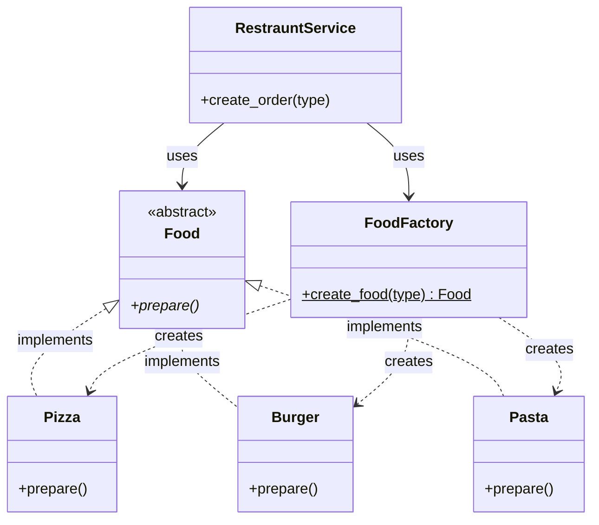
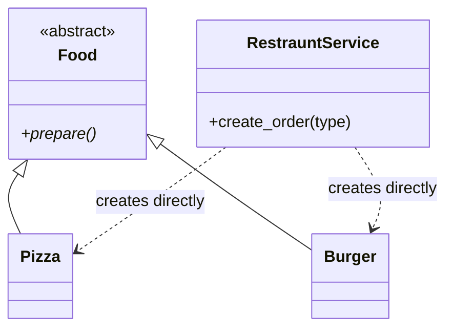
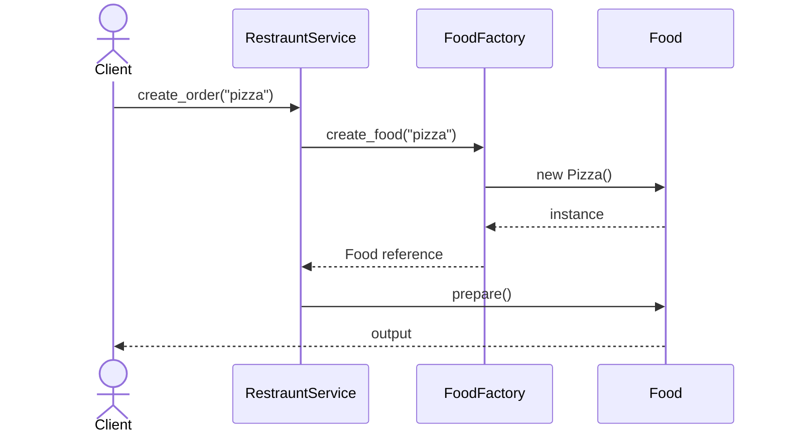
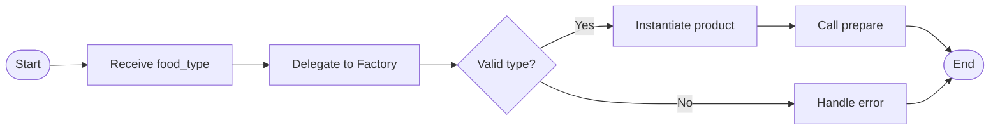
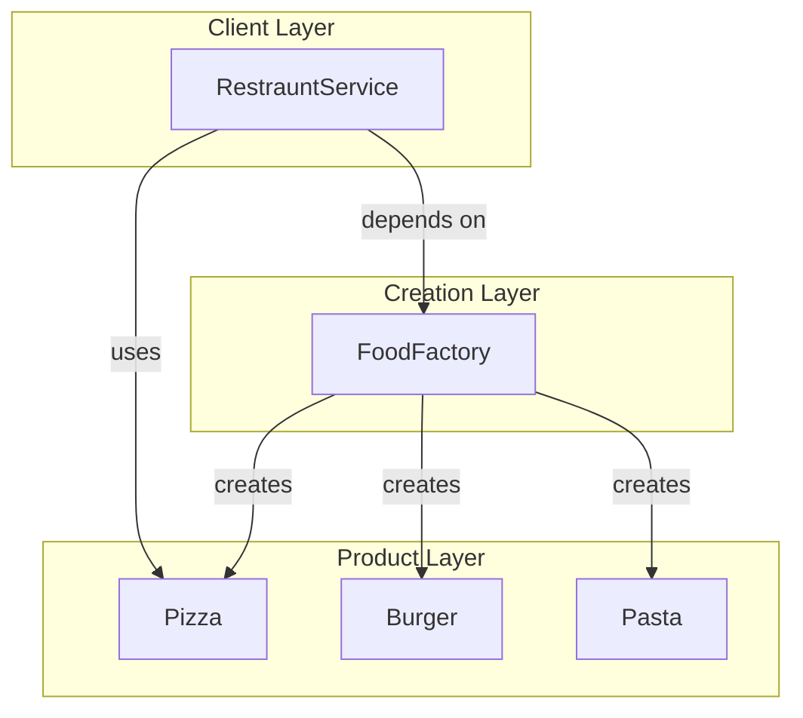
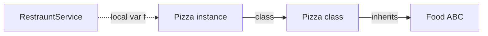
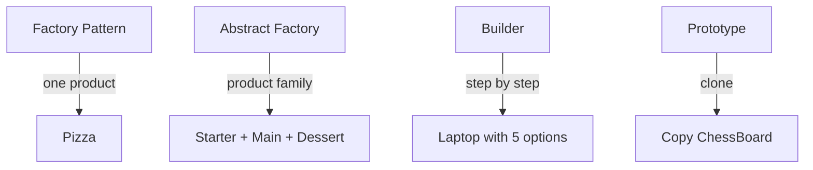

# Factory Pattern — UML & Diagrams

---

## Class Diagram (Good Example)



---

## Class Diagram (Bad Example)



---

## Sequence Diagram



---

## Activity Diagram



---

## Object Relationship Diagram



---

## ASCII Class Diagram

```
+---------------------+
|  RestrauntService   |
+---------------------+
| + create_order()    |
+----------+----------+
           | uses
           v
+---------------------+
|    FoodFactory      |
+---------------------+
| + create_food() $   |
+----------+----------+
           | creates
     +-----+-----+
     v           v
+--------+   +--------+
| Pizza  |   | Burger |
+--------+   +--------+
     ^           ^
     |           |
     +-----+-----+
           |
    implements Food.prepare()
```

---

## State: Object Graph at Runtime

After `create_order("pizza")`:



---

## Comparison: Factory vs Related Patterns



---

## 📌 Diagram Revision

Draw from memory: **Client → Factory → Product**. Factory has `create()`; Product has shared interface.
