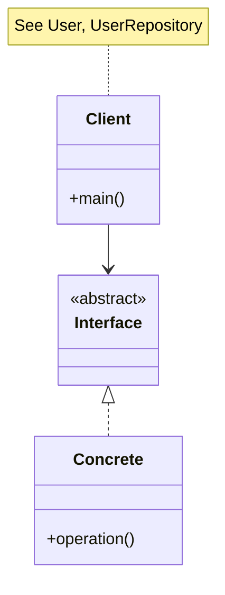
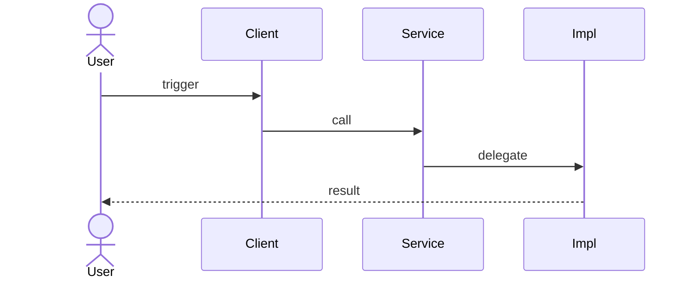
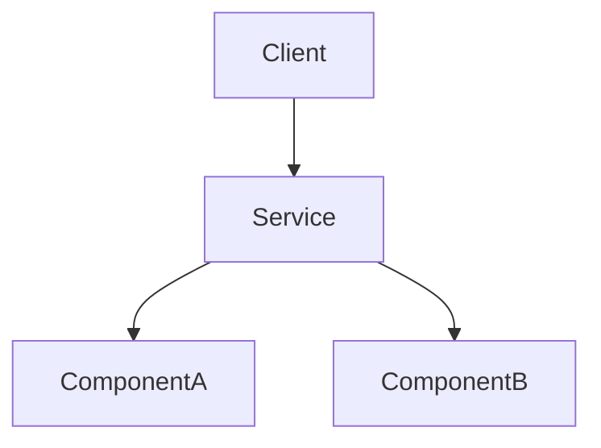
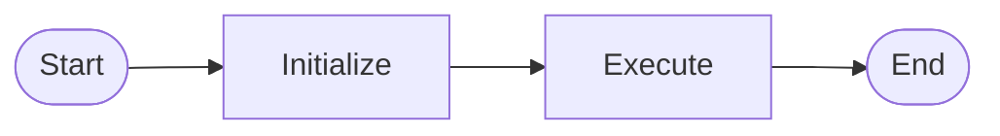

# Single Responsibility Principle (SRP) — UML & Diagrams

---

## Class Diagram



---

## Sequence Diagram



---

## Object Relationship Diagram



---

## ASCII Overview

```
+-------------+
|   Client    |
+------+------+
       |
       v
+-------------+
|  Abstraction |
+------+------+
       ^
       |
+-------------+
|  Concrete   |
+-------------+
```

---

## Activity Diagram



---

## 📌 Draw From Memory

Practice drawing: **Client → Abstraction → Concrete** with method labels.

