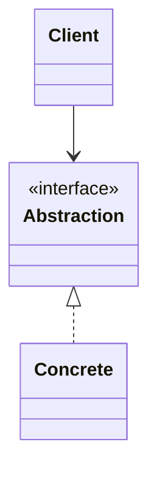
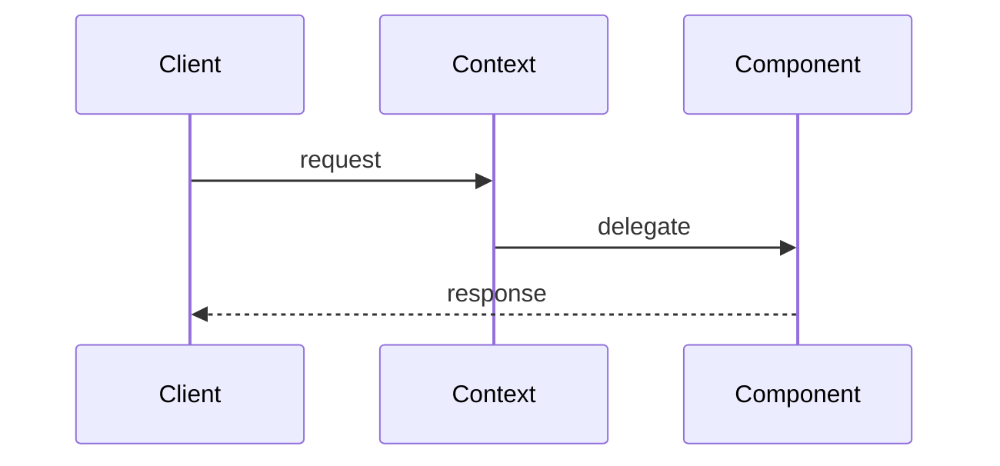

# Interface Segregation Principle (ISP)

---

## What problem does this solve?

Fat interface forces `Robot` to implement `eat()` which raises Exception — clients depend on methods they don't use.

---

## Why was this pattern introduced?

Without this design, code becomes brittle — every new feature requires editing existing classes. Large applications (Netflix, Uber, banking systems) need **extensible** object structures where components communicate through clear contracts.

---

## Real-world analogy

A **swiss army knife** interface for a **screwdriver** — you shouldn't need a corkscrew method to use the flathead.

---

## Where is this used?

| Domain | Example |
|--------|---------|
| Tech | Google, Amazon, Uber architectures |
| Finance | Payment processing, account hierarchies |
| Media | Spotify playlists, Netflix recommendations |
| Daily life | Food delivery, hospital systems, libraries |

---

## UML Diagram



> See [UML.md](UML.md) for full diagrams.

---

## Folder Structure

```
2. SOLID Principles/4. Interface Segregation Principle (ISP)/
├── 1. bad_example.py
├── 2. good_example.py
├── NOTES.md
├── FLOW.md
├── UML.md
├── INTERVIEW.md
└── CHEATSHEET.md
```

| File | Purpose |
|------|--------|
| `1. bad_example.py` | Fat Employee interface |
| `2. good_example.py` | Segregated Workable and Eatable |


## Bad vs Good

| Bad | Good |
|-----|------|
| `Employee` ABC with eat() + work(); Robot.eat() throws | `Workable` + `Eatable` separate; Robot implements only Workable |


## Code Walkthrough

**Key classes:** `Workable, Eatable, Robot, Employee`

Read each Python file in order listed in the folder structure. Every class exists to model one responsibility. Methods define the contract between objects.

> **💡 Interview Tip**
>
> Explain *why* each class exists before explaining *what* it does.

---

## Execution Flow

```bash
cd "4. Interface Segregation Principle (ISP)"
python 2. good_example.py
```

See [FLOW.md](FLOW.md) for step-by-step flow.

---

## Object Interaction



---

## Memory Representation

```
Stack                    Heap
─────                    ────
client ref ───────────►  Domain objects
                         linked by references
```

---

## Why is this implementation good?

| Decision | Reason |
|----------|--------|
| Separation of concerns | Each class has one job |
| Abstraction (ABC) | Clients depend on interfaces |
| Encapsulation | Private `__attrs` hide internals |

---

## Advantages

- **Maintainability** — localized changes
- **Testability** — mock dependencies
- **Extensibility** — add classes without editing clients
- **Readability** — clear object roles

## Disadvantages

- **More files** — indirection overhead
- **Learning curve** — beginners may over-apply patterns
- **Over-engineering risk** — don't use patterns for trivial problems

---

## Common Beginner Mistakes

| Mistake | Avoid |
|---------|-------|
| Jumping to patterns without understanding problem | Ask "what breaks without this?" |
| God classes | Split responsibilities (SRP) |
| Ignoring composition | Favor has-a over is-a when appropriate |

---

## Python-Specific Notes

| Feature | Usage |
|---------|-------|
| `abc.ABC` | Interface definition |
| `@abstractmethod` | Force subclass implementation |
| `__` name mangling | Private attributes |
| Type hints | Document contracts |
| `super()` | Parent initialization |

**Python vs Java:** Python uses ABCs or Protocols instead of `interface` keyword. Duck typing works but ABCs are clearer in interviews.

---

## Comparison Table

| Approach | Without Pattern | With Pattern |
|----------|-----------------|--------------|
| Extension | Edit existing code | Add new class |
| Testing | Hard to isolate | Mock interfaces |
| Coupling | High | Low |

---

## Summary

Interface Segregation Principle (ISP) teaches you to structure objects so systems grow without breaking. Master the **intent**, draw the **diagram**, then read the **code**.


---

## 📌 5 Minute Revision

- **Problem:** See "What problem does this solve?" above
- **Solution:** Study the good example / pattern structure
- **Key classes:** ISP in Adapter, small ABCs
- **Run:** `ISP in Adapter, small ABCs`

## 📌 1 Minute Revision

> Understand the **why** before the **how**. Draw the diagram, then explain object communication.

## 📌 Related Patterns

ISP in Adapter, small ABCs

## 📌 Next Topic to Learn

→ **Dependency Inversion Principle (DIP)**

