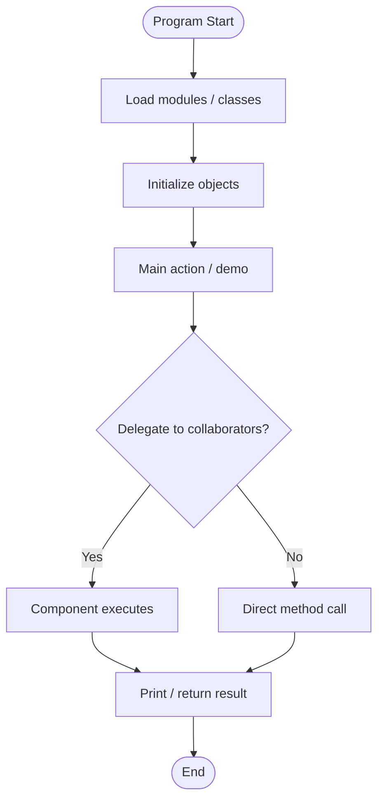
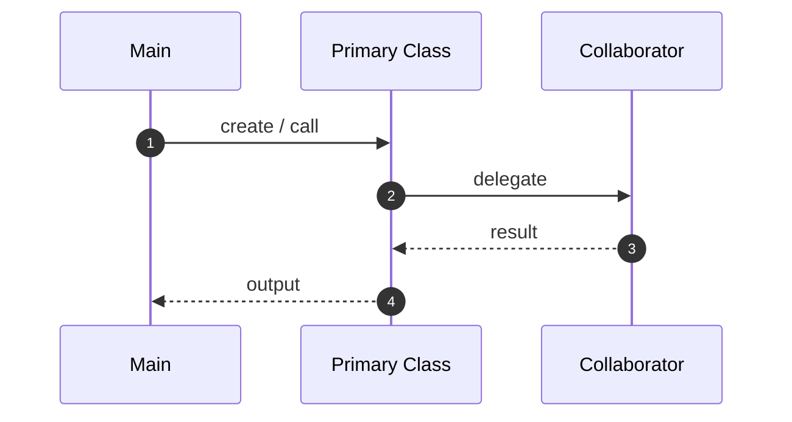
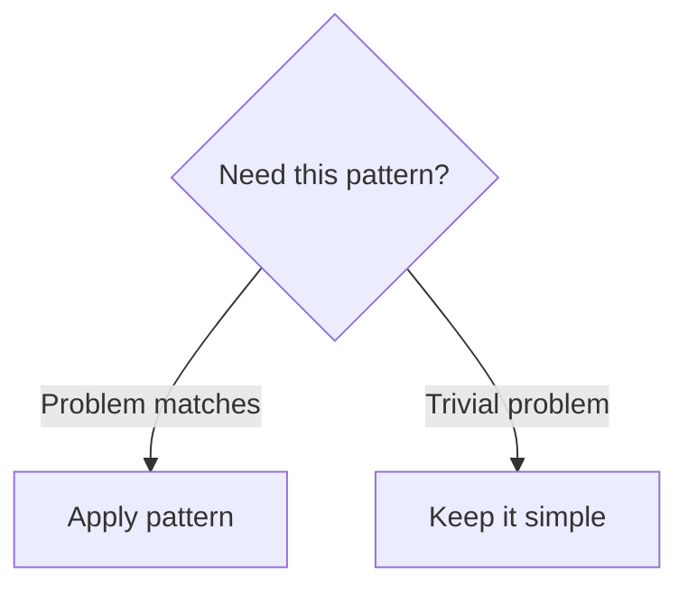

# Ride Sharing — Bad Design — Execution Flow

---

## How to Run

```bash
cd "21. Ride Sharing Project - Bad Example"
python client.py
```

---

## Flowchart



---

## Step-by-Step

| Step | Action |
|------|--------|
| 1 | Python interpreter loads `.py` files |
| 2 | Classes defined on heap (type objects) |
| 3 | Module-level or main code creates instances |
| 4 | client → bookRide → find driver → calc fare (broken distance) |
| 5 | Output printed to stdout |

---

## Sequence Diagram



---

## Decision Tree



---

## 📌 Quick Revision

**Flow:** client → bookRide → find driver → calc fare (broken distance)

