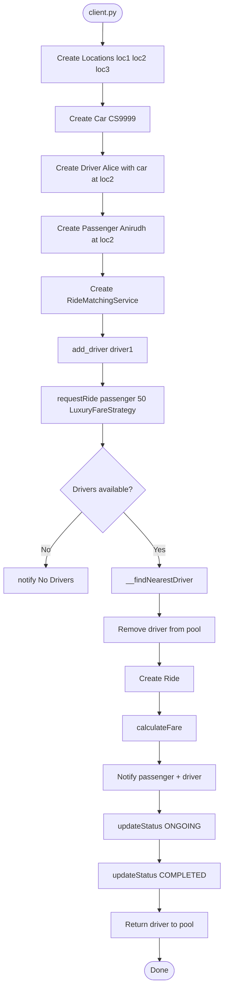
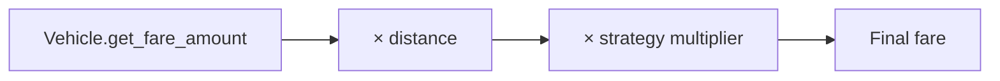
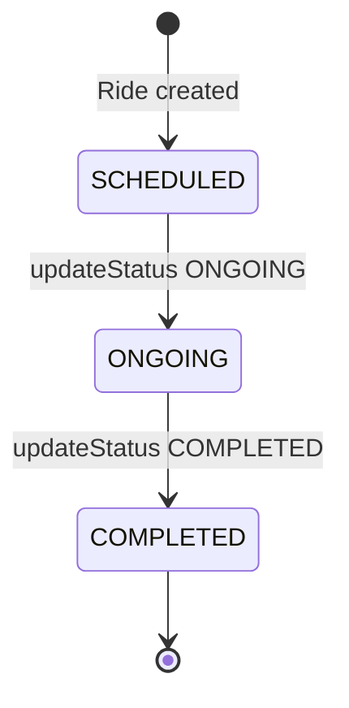
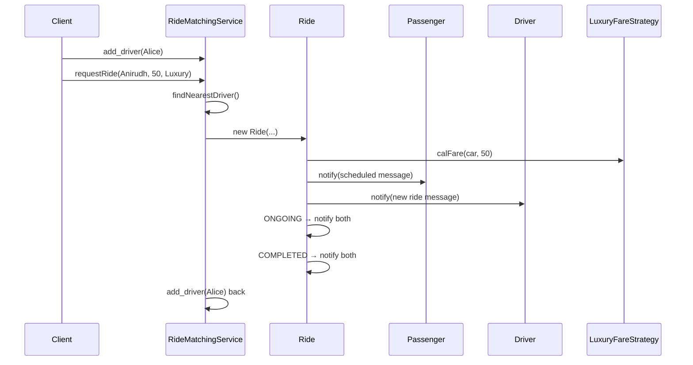

# Ride Sharing Good Example — Execution Flow

---

## Run

```bash
cd "22. Ride Sharing Project - Good Example"
python client.py
```

---

## End-to-End Flowchart



---

## Fare Calculation Detail

```
Car.get_fare_amount()     = 20
distance                  = 50
LuxuryFareStrategy        = × 1.5

fare = 20 × 50 × 1.5 = Rs. 1500
```



---

## Nearest Driver Algorithm

```python
for driver in __available_drivers:
    dist = driver.get_location().calcDistance(passenger_location)
    if dist < minDistance:
        assignedDriver = driver
```

With one driver in `client.py`, Alice is always selected.

---

## Ride Status State Machine



Each transition calls `__notifyUsers()` — passenger and driver both notified.

---

## Sequence Diagram



---

## 📌 Quick Revision

**Match → Fare (Strategy) → Notify → ONGOING → COMPLETED → Return driver**
