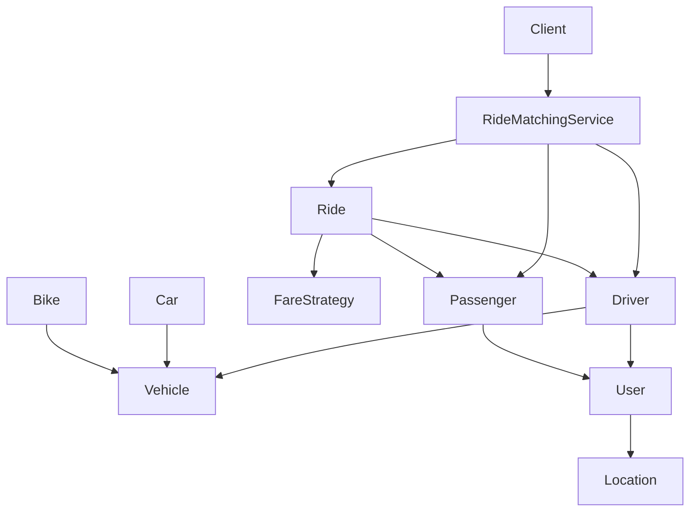
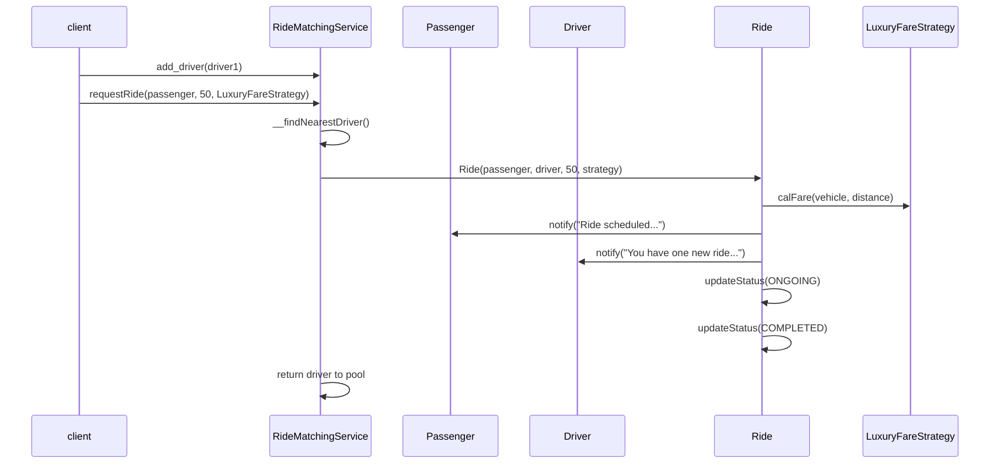

# Ride Sharing — Good Design (Capstone)

---

## What problem does this solve?

Designing **Uber/Ola** in an interview isn't about `if vehicle == "car"`. It's about modeling **users, vehicles, rides, pricing, and matching** so each piece can change independently.

This capstone applies everything from OOP → SOLID → Strategy → Observer-like notifications in one cohesive system.

---

## Why does the good design exist?

The [bad example (folder 21)](../21.%20Ride%20Sharing%20Project%20-%20Bad%20Example/NOTES.md) has:

- God-class `RideSharingServiceApp`
- Missing `__calcDistance()` method (runtime crash)
- Hardcoded fare `if/elif`
- No ride lifecycle
- String-based vehicle types

The **good example** fixes each smell with proper abstractions.

---

## Real-world analogy

**Uber's ride flow**

```
Passenger requests ride
    → Matching service finds nearest available driver
    → Fare engine calculates price (surge/luxury/shared)
    → Ride created with status SCHEDULED → ONGOING → COMPLETED
    → Passenger + Driver notified at each step
    → Driver returned to available pool
```

---

## Architecture Diagram



---

## Folder Structure

```
22. Ride Sharing Project - Good Example/
├── location.py              ← Coordinates + distance calculation
├── user.py                  ← Abstract User (name, email, location, notify)
├── driver.py                ← Driver extends User, has Vehicle
├── passenger.py             ← Passenger extends User
├── vehicle.py               ← Vehicle ABC with get_fare_amount()
├── car.py                   ← Car — fare rate 20/km
├── bike.py                  ← Bike — fare rate 10/km
├── fare_strategy.py         ← Strategy: Standard, Shared, Luxury
├── ride.py                  ← Ride entity + RideStatus enum
├── ride_matching_service.py ← Orchestrator — matching + booking
├── client.py                ← End-to-end demo
└── [NOTES, FLOW, UML, INTERVIEW, CHEATSHEET].md
```

---

## Bad vs Good Comparison

| Concern | Bad (21) | Good (22) |
|---------|----------|-----------|
| Fare | Hardcoded in service | `FareStrategy` — Strategy Pattern |
| Vehicle | String `type` field | `Car`/`Bike` extend `Vehicle` |
| Users | Separate unrelated classes | `User` ABC — shared `notify()` |
| Distance | Missing method | `Location.calcDistance()` |
| Ride lifecycle | None | `Ride` + `RideStatus` enum |
| Driver pool | No availability | Remove on assign, restore on complete |
| Notifications | Print in service | `user.notify()` polymorphism |

---

## Code Walkthrough

### `location.py`

`calcDistance(other)` uses Euclidean distance — enables nearest-driver matching.

### `user.py` → `driver.py` / `passenger.py`

```python
class User(ABC):
    def notify(self, msg): ...  # abstract
```

Both driver and passenger **notify** on ride events — Observer-like without formal observer list.

### `vehicle.py` → `car.py` / `bike.py`

```python
class Car(Vehicle):
    def get_fare_amount(self) -> float:
        return 20
```

Polymorphic fare base — adding `Auto` means new class, not editing matching service.

### `fare_strategy.py` — Strategy Pattern

| Strategy | Multiplier |
|----------|------------|
| `StandardFareStrategy` | 1.0× |
| `SharedFareStrategy` | 0.5× |
| `LuxuryFareStrategy` | 1.5× |

Injected at `requestRide(passenger, distance, strategy)` — OCP in action.

### `ride.py`

- Holds passenger, driver, distance, strategy
- `calculateFare()` = `vehicle.get_fare_amount() × distance × strategy.calFare()`
- `updateStatus()` triggers `__notifyUsers()` on status change

### `ride_matching_service.py`

| Method | Responsibility |
|--------|----------------|
| `add_driver()` | Register available driver |
| `requestRide()` | Match → create ride → fare → notify → lifecycle |
| `__findNearestDriver()` | O(n) nearest by `calcDistance` |

---

## Execution Flow

```bash
cd "22. Ride Sharing Project - Good Example"
python client.py
```

See [FLOW.md](FLOW.md) for full trace.

---

## Object Interaction



---

## Patterns Used

| Pattern | Where |
|---------|-------|
| **Strategy** | `FareStrategy` hierarchy |
| **Template Method** | `User` base with abstract `notify()` |
| **Inheritance** | `Driver`/`Passenger` extend `User`; `Car`/`Bike` extend `Vehicle` |
| **Observer-like** | `notify()` on status changes |
| **SRP** | Each class has one job |
| **OCP** | New vehicle/strategy without editing matching service |
| **DIP** | `Ride` depends on `FareStrategy` abstraction |

---

## Interview Walkthrough Script

1. **Entities:** User, Driver, Passenger, Vehicle, Ride, Location
2. **Services:** RideMatchingService orchestrates
3. **Matching:** Nearest driver by Euclidean distance
4. **Pricing:** Strategy pattern — inject at request time
5. **Lifecycle:** SCHEDULED → ONGOING → COMPLETED with notifications
6. **Extensibility:** Add `PoolRideStrategy`, `ElectricCar`, `RatingService`

---

## Common Beginner Mistakes

| Mistake | Better Approach |
|---------|-----------------|
| One `RideService` does everything | Split matching, fare, ride entity |
| Fare as if/elif in service | Strategy pattern |
| Vehicle as string enum | Polymorphic Vehicle hierarchy |
| No ride status | Enum + state transitions |

---

## Summary

This capstone demonstrates **production-minded LLD**: small focused classes, strategy for variation, inheritance for shared behavior, and clear orchestration in `RideMatchingService`. Study folder 21 first to see the smells, then folder 22 for the fix.

---

## 📌 5 Minute Revision

1. **Entities:** User, Driver, Passenger, Vehicle, Ride, Location
2. **Strategy:** FareStrategy at request time
3. **Flow:** match → fare → notify → ONGOING → COMPLETED → return driver
4. **Patterns:** Strategy, inheritance, SRP, OCP
5. **vs Bad:** No god class, no missing methods, no hardcoded fares

## 📌 1 Minute Revision

> `requestRide` → nearest driver → `Ride` + `FareStrategy` → notify → status updates

## 📌 Related Patterns

Strategy · Observer-like notify · Facade (could wrap RMS for API)

## 📌 Next Topic

Mock LLD interviews — design Parking Lot, Library, or Vending Machine using these patterns
