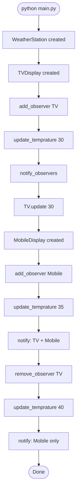
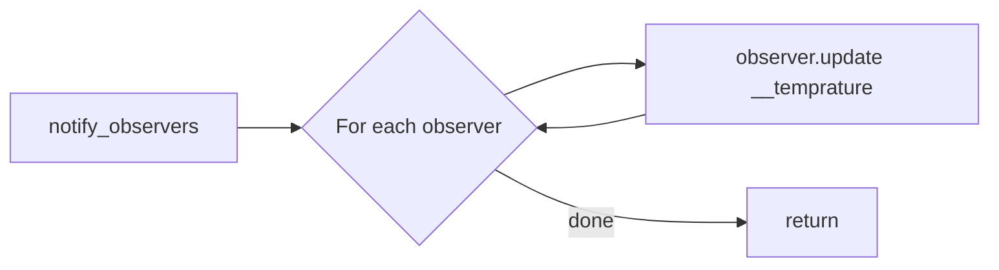
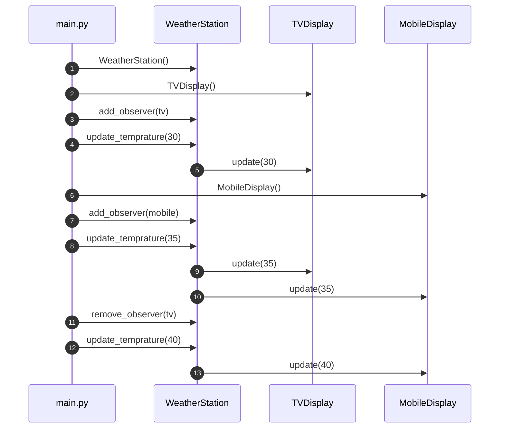
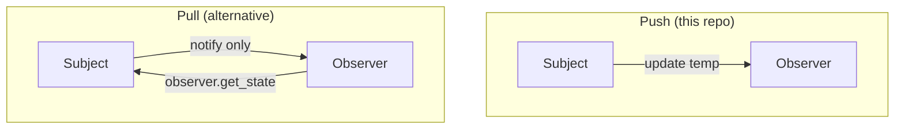

# Observer Pattern — Execution Flow

---

## How to Run

```bash
cd "4. Observer Pattern"
python main.py
```

---

## Full Execution Flowchart



---

## Step-by-Step Trace

### Phase 1 — TV Only (temp = 30)

| Step | Code | Output |
|------|------|--------|
| 1 | `ws = WeatherStation()` | Empty observer list |
| 2 | `tv = TVDisplay()` | TV observer created |
| 3 | `ws.add_observer(tv)` | `[tv]` in list |
| 4 | `ws.update_temprature(30)` | Sets `__temprature=30`, calls notify |
| 5 | `tv.update(30)` | `TV Display: Temperature updated to 30°C` |

### Phase 2 — TV + Mobile (temp = 35)

| Step | Code | Effect |
|------|------|--------|
| 6 | `mobile = MobileDisplay()` | New observer |
| 7 | `ws.add_observer(mobile)` | `[tv, mobile]` |
| 8 | `ws.update_temprature(35)` | Both `update(35)` called |

### Phase 3 — Mobile Only (temp = 40)

| Step | Code | Effect |
|------|------|--------|
| 9 | `ws.remove_observer(tv)` | `[mobile]` |
| 10 | `ws.update_temprature(40)` | Only mobile notified |

---

## Inside `notify_observers()`



```python
def notify_observers(self):
    for observer in self.__observers:
        observer.update(self.__temprature)
```

---

## Sequence Diagram (Complete Run)



---

## Push vs Pull Models

This repo uses **push** — subject sends `temp` to observers.



---

## Memory During Execution

After step 7 (`add_observer(mobile)`):

```
WeatherStation.__observers
    [0] ──► TVDisplay instance
    [1] ──► MobileDisplay instance
```

After step 9 (`remove_observer(tv)`):

```
WeatherStation.__observers
    [0] ──► MobileDisplay instance
```

---

## 📌 Quick Revision

**Subscribe → Change state → Notify all → Unsubscribe → Notify remaining**
