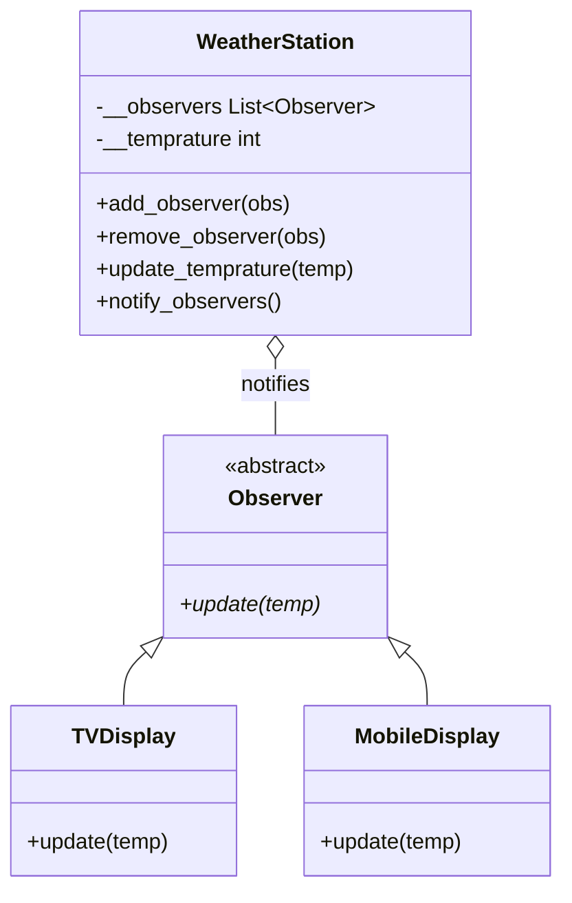
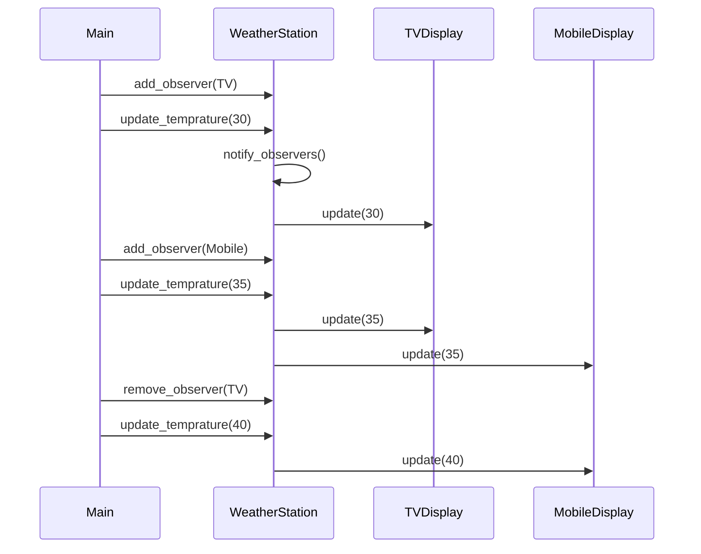

# Observer Pattern

---

## What problem does this solve?

Imagine **WhatsApp group notifications**. When someone sends a message, every member gets notified automatically. The sender doesn't manually call each person.

In software, when **state changes** in one object (temperature rises), **many dependent objects** (TV display, mobile app, web dashboard) must react — without the subject knowing their concrete types.

Without Observer, `WeatherStation` would look like:

```python
def update_temperature(self, temp):
    self.tv_display.show(temp)
    self.mobile_display.show(temp)
    self.web_dashboard.show(temp)  # edit WeatherStation for every new display!
```

---

## Why was this pattern introduced?

| Without Observer | With Observer |
|------------------|---------------|
| Subject knows all concrete displays | Subject knows only `Observer` interface |
| Adding mobile app = edit WeatherStation | Register `MobileDisplay` at runtime |
| Tight coupling | Loose coupling via subscribe/notify |
| Hard to test | Mock observers easily |

Event-driven systems (Kafka, React state, MVC) all build on this publish-subscribe idea.

---

## Real-world analogy

**Google Maps traffic alerts**

```
Traffic sensor (Subject) detects congestion
        ↓
Notifies: your phone, car dashboard, smart watch (Observers)
        ↓
Each device shows alert in its own UI format
```

The sensor doesn't know you're using an iPhone vs Android.

---

## Where is this pattern used?

| System | Subject | Observers |
|--------|---------|-----------|
| MVC (Django, Spring) | Model | Views update on data change |
| React | State store | Components re-render |
| Stock market | Price feed | Trader dashboards |
| GitHub | Repository | Webhooks to CI/CD |
| Ride sharing (folder 22) | `Ride` status | `notify()` on users |

---

## UML Diagram



---

## Folder Structure

```
4. Observer Pattern/
├── observer.py           ← Abstract Observer interface
├── weather_station.py    ← Subject (publisher)
├── tv.py                 ← Concrete observer — TV
├── mobile.py             ← Concrete observer — Mobile
├── main.py               ← Demo: subscribe, notify, unsubscribe
├── NOTES.md
├── FLOW.md
├── UML.md
├── INTERVIEW.md
└── CHEATSHEET.md
```

| File | Purpose |
|------|---------|
| `observer.py` | Defines `update(temp)` contract all displays must implement |
| `weather_station.py` | Maintains observer list; pushes temperature on change |
| `tv.py` / `mobile.py` | React to temperature in display-specific format |
| `main.py` | Orchestrates subscribe → notify → unsubscribe flow |

---

## Code Walkthrough

### `observer.py` — The Contract

```python
class Observer(ABC):
    @abstractmethod
    def update(self, temp):
        pass
```

**Why it exists:** Any display can be plugged in as long as it implements `update()`. WeatherStation never imports `TVDisplay` by name in its core logic.

### `weather_station.py` — The Subject

| Method | Purpose |
|--------|---------|
| `add_observer()` | Subscribe — append to `__observers` list |
| `remove_observer()` | Unsubscribe — remove from list |
| `update_temprature()` | State change → triggers notification |
| `notify_observers()` | Loop all observers, call `update(temp)` |

**Encapsulation:** `__temprature` and `__observers` are private — external code can't corrupt the list directly.

### `tv.py` / `mobile.py` — Concrete Observers

Each implements `update(temp)` with its own output format. Same data, different presentation — classic polymorphism.

### `main.py` — The Demo

1. Register TV → temp 30 → TV only notified
2. Register Mobile → temp 35 → both notified
3. Remove TV → temp 40 → Mobile only notified

---

## Execution Flow

See [FLOW.md](FLOW.md).

---

## Object Interaction



---

## Memory Representation

```
Stack                    Heap
─────                    ────
ws ──────────────────►  WeatherStation
                            __observers ──► [ref₁, ref₂]
                                                │     │
                                                ▼     ▼
                                            TVDisplay  MobileDisplay
```

The subject holds **references** to observers — not copies. Same observer instance receives all future updates until removed.

---

## Why is this implementation good?

| Decision | Reason |
|----------|--------|
| `List[Observer]` not `List[TVDisplay]` | Open for new observer types |
| Push model (`notify_observers`) | Subject controls when observers learn of changes |
| `remove_observer` | Prevents memory leaks / stale updates |
| ABC for Observer | Explicit contract for interviews and tooling |

---

## Advantages

- **Loose coupling** — Subject and observers interact through interface only
- **Dynamic subscription** — Add/remove observers at runtime
- **Open/Closed** — New displays without editing WeatherStation
- **Broadcast** — One state change notifies many dependents

## Disadvantages

- **Unexpected updates** — Observers may be notified when they don't care
- **Order dependency** — Notification order may matter (not handled here)
- **Memory leaks** — Forgetting to `remove_observer` keeps dead references
- **Debugging** — Hard to trace who triggered what in large systems

---

## Common Beginner Mistakes

| Mistake | Fix |
|---------|-----|
| Subject calls concrete `tv.show()` directly | Use `Observer.update()` |
| Observer pulls data from subject internals | Pass needed data as `update(temp)` args |
| Confusing Observer with Mediator | Observer = one-to-many broadcast; Mediator = colleague routing |
| No unsubscribe | Always `remove_observer` when display destroyed |

---

## Python-Specific Notes

| Feature | Usage |
|---------|-------|
| `abc.ABC` | `Observer` interface |
| `typing.List[Observer]` | Type-safe observer collection |
| `__` name mangling | Private `__observers`, `__temprature` |
| Duck typing alternative | Any class with `update()` works — ABC is clearer for LLD |

**Python vs Java:** Java has `java.util.Observer` (deprecated). Python has no built-in — you implement manually or use `blinker`/event libraries.

---

## Comparison Table

| Feature | Observer | Mediator | Pub/Sub |
|---------|----------|----------|---------|
| Communication | Subject → Observers | Via central mediator | Via message broker |
| Coupling | Subject knows observers exist | Colleagues don't know each other | Fully decoupled |
| This repo | Folder 4 | Folder 10 | Production scale |

---

## Summary

Observer Pattern defines a **one-to-many dependency**: when the subject's state changes, all registered observers are notified automatically. Subscribe with `add_observer`, react in `update()`, unsubscribe with `remove_observer`.

---

## 📌 5 Minute Revision

1. **Subject** = WeatherStation (state + notify)
2. **Observer** = TV, Mobile (react to changes)
3. **Subscribe** = add_observer; **Unsubscribe** = remove_observer
4. **Push model** = subject calls observer.update(data)
5. **Benefit** = add displays without editing subject

## 📌 1 Minute Revision

> Subject changes state → loops observers → each calls `update(temp)`.

## 📌 Interview Questions

See [INTERVIEW.md](INTERVIEW.md)

## 📌 Cheat Sheet

See [CHEATSHEET.md](CHEATSHEET.md)

## 📌 Related Patterns

- **Mediator** — central hub instead of direct subject-observer
- **Strategy** — swap algorithm, not notify dependents
- **MVC** — Model is subject, View is observer

## 📌 Next Topic to Learn

→ [5. Strategy Pattern](../5.%20Strategy%20Pattern/NOTES.md)
