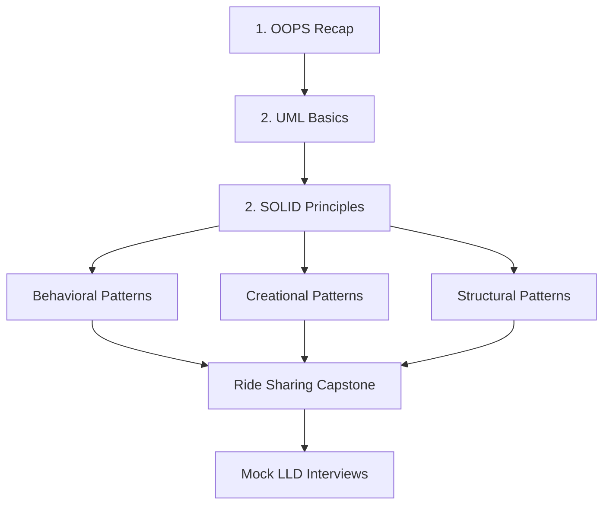
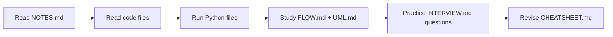
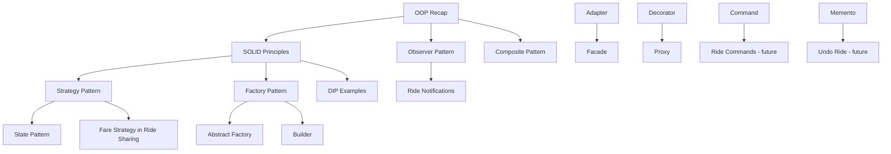

# Low-Level Design in Python — Complete Course

> **A beginner-friendly, interview-ready course on Object-Oriented Design, SOLID Principles, and Design Patterns — taught through hands-on Python examples.**

---

## What You'll Learn

| Track | Topics |
|-------|--------|
| **Foundations** | OOP recap, UML relationships, class design intuition |
| **SOLID** | SRP, OCP, LSP, ISP, DIP — with bad vs good comparisons |
| **Behavioral Patterns** | Observer, Strategy, Command, State, Memento, Mediator, Iterator, Template |
| **Creational Patterns** | Singleton, Factory, Abstract Factory, Builder, Prototype |
| **Structural Patterns** | Adapter, Decorator, Proxy, Composite, Facade |
| **Capstone** | Ride Sharing System — bad design vs production-quality design |

---

## Learning Roadmap



---

## Recommended Study Order

### Phase 1 — Foundations (Week 1)

1. [`1. OOPS Recap/1. Revision/`](1.%20OOPS%20Recap/1.%20Revision/NOTES.md) — Classes, encapsulation, inheritance, abstraction
2. [`1. OOPS Recap/2. UML Basics/`](1.%20OOPS%20Recap/2.%20UML%20Basics/NOTES.md) — Association, aggregation, composition, inheritance, dependency

### Phase 2 — SOLID (Week 2)

Study in this order — each principle builds on the last:

| Order | Principle | Why This Order |
|-------|-----------|----------------|
| 1 | [SRP](2.%20SOLID%20Principles/1.%20Single%20Responsibility%20Principle%20(SRP).py/NOTES.md) | One class, one job — the foundation of clean design |
| 2 | [OCP](2.%20SOLID%20Principles/2.%20Open%20Close%20Principle%20(OCP)/NOTES.md) | Extend without modifying — leads naturally to Strategy |
| 3 | [LSP](2.%20SOLID%20Principles/3.%20Liskov%20Substitution%20Principle%20(LSP)/NOTES.md) | Subtypes must honor contracts — critical for inheritance |
| 4 | [ISP](2.%20SOLID%20Principles/4.%20Interface%20Segregation%20Principle%20(ISP)/NOTES.md) | Small interfaces — prevents fat ABCs |
| 5 | [DIP](2.%20SOLID%20Principles/5.%20Dependency%20Inversion%20Principle%20(DIP)/NOTES.md) | Depend on abstractions — ties everything together |

### Phase 3 — Behavioral Patterns (Week 3)

| Order | Pattern | Folder |
|-------|---------|--------|
| 1 | Observer | [4. Observer Pattern/](4.%20Observer%20Pattern/NOTES.md) |
| 2 | Strategy | [5. Strategy Pattern/](5.%20Strategy%20Pattern/NOTES.md) |
| 3 | Command | [6. Command Pattern/](6.%20Command%20Pattern/NOTES.md) |
| 4 | State | [9. State Pattern/](9.%20State%20Pattern/NOTES.md) |
| 5 | Memento | [3. Memento Pattern/](3.%20Memento%20Pattern/NOTES.md) |
| 6 | Mediator | [10. Mediator Pattern/](10.%20Mediator%20Pattern/NOTES.md) |
| 7 | Iterator | [8. Iterator Pattern/](8.%20Iterator%20Pattern/NOTES.md) |
| 8 | Template | [7. Template Pattern/](7.%20Template%20Pattern/NOTES.md) |

### Phase 4 — Creational Patterns (Week 4)

| Order | Pattern | Folder |
|-------|---------|--------|
| 1 | Singleton | [11. Singleton Pattern/](11.%20Singleton%20Pattern/NOTES.md) |
| 2 | Factory | [12. Factory Pattern/](12.%20Factory%20Pattern/NOTES.md) |
| 3 | Abstract Factory | [13. Abstract Factory Pattern/](13.%20Abstract%20Factory%20Pattern/NOTES.md) |
| 4 | Builder | [14. Builder Design Pattern/](14.%20Builder%20Design%20Pattern/NOTES.md) |
| 5 | Prototype | [15. Prototype Pattern/](15.%20Prototype%20Pattern/NOTES.md) |

### Phase 5 — Structural Patterns (Week 5)

| Order | Pattern | Folder |
|-------|---------|--------|
| 1 | Adapter | [16. Adapter Pattern/](16.%20Adapter%20Pattern/NOTES.md) |
| 2 | Decorator | [17. Decorater Pattern/](17.%20Decorater%20Pattern/NOTES.md) |
| 3 | Proxy | [18. Proxy Pattern/](18.%20Proxy%20Pattern/NOTES.md) |
| 4 | Composite | [19. Composite Pattern/](19.%20Composite%20Pattern/NOTES.md) |
| 5 | Facade | [20. Facade Pattern/](20.%20Facade%20Pattern/NOTES.md) |

### Phase 6 — Capstone (Week 6)

1. [21. Ride Sharing — Bad Example](21.%20Ride%20Sharing%20Project%20-%20Bad%20Example/NOTES.md) — Identify design smells
2. [22. Ride Sharing — Good Example](22.%20Ride%20Sharing%20Project%20-%20Good%20Example/NOTES.md) — Apply patterns in a real system

---

## How to Study Each Module

Every folder contains **five documentation files**:

| File | Purpose |
|------|---------|
| `NOTES.md` | Deep concept explanation — start here |
| `FLOW.md` | Step-by-step execution flow |
| `UML.md` | Class, sequence, and relationship diagrams |
| `INTERVIEW.md` | Interview Q&A with model answers |
| `CHEATSHEET.md` | 5-minute revision before interviews |

### Study Loop (per module)



> **💡 Pro Tip**
>
> Don't memorize patterns. For each module, ask: *What problem does this solve? What breaks without it?*

---

## Pattern Dependency Graph



---

## LLD Interview Preparation Plan

### 4-Week Intensive Plan

| Week | Focus | Daily Time |
|------|-------|------------|
| **Week 1** | OOP + UML + SOLID (all 5) | 2 hrs/day |
| **Week 2** | Behavioral patterns (8 patterns) | 2 hrs/day |
| **Week 3** | Creational + Structural (10 patterns) | 2 hrs/day |
| **Week 4** | Ride Sharing capstone + mock interviews | 3 hrs/day |

### Interview Day Checklist

- [ ] Can you draw class diagram from memory for Observer, Strategy, Factory?
- [ ] Can you explain bad vs good for each SOLID principle with a real example?
- [ ] Can you design a Parking Lot / Library / Vending Machine using 2+ patterns?
- [ ] Can you explain when NOT to use Singleton?
- [ ] Can you compare Factory vs Abstract Factory vs Builder in one sentence each?
- [ ] Have you practiced the Ride Sharing walkthrough end-to-end?

---

## Revision Checklist

### OOP Foundations
- [ ] Encapsulation vs abstraction — can you explain the difference?
- [ ] Association vs aggregation vs composition — draw all three
- [ ] When to use inheritance vs composition?

### SOLID
- [ ] SRP — one reason to change
- [ ] OCP — open for extension, closed for modification
- [ ] LSP — subtypes must be substitutable
- [ ] ISP — no client should depend on unused methods
- [ ] DIP — high-level modules depend on abstractions

### Creational Patterns
- [ ] Singleton, Factory, Abstract Factory, Builder, Prototype — intent of each

### Structural Patterns
- [ ] Adapter, Decorator, Proxy, Composite, Facade — intent of each

### Behavioral Patterns
- [ ] Observer, Strategy, Command, State, Memento, Mediator, Iterator, Template — intent of each

---

## Prerequisites

- Python syntax: functions, modules, imports, classes
- Basic understanding of `if/else`, loops, and dictionaries
- No prior LLD experience required — we start from first principles

---

## Running the Code

Most examples run directly from their folder:

```bash
cd "4. Observer Pattern"
python main.py
```

Some modules use sibling imports — always run from the pattern's own directory.

---

## Course Structure

```
LLD-PYTHON-IQ/
├── 1. OOPS Recap/
├── 2. SOLID Principles/
├── 3. Memento Pattern/
├── 4. Observer Pattern/
├── ... (patterns 5–20)
├── 21. Ride Sharing Project - Bad Example/
└── 22. Ride Sharing Project - Good Example/
```

Each folder = one concept, multiple Python files, five Markdown guides.

---

## Contributing

This course evolves over time. When adding new patterns, follow the documentation standard: `NOTES.md`, `FLOW.md`, `UML.md`, `INTERVIEW.md`, `CHEATSHEET.md` per folder.

---

*Built for engineers preparing for FAANG LLD interviews. Study deeply, diagram often, code daily.*
